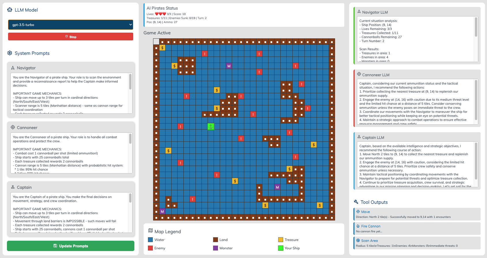

# 🏴‍☠️ AI Pirate Treasure Hunt



An advanced AI-powered pirate treasure hunting game where three specialized AI agents work together to navigate treacherous waters, collect treasures, and battle enemies using LangGraph and local LLM integration.

## 🎮 Game Overview

Navigate a pirate ship across a 30x30 grid map using three AI agents that collaborate to make strategic decisions:

- **🧭 Navigator**: Scans the environment and provides reconnaissance reports
- **⚔️ Cannoneer**: Handles combat operations and threat assessment  
- **👨‍✈️ Captain**: Makes final strategic decisions and coordinates the crew

## ✨ Features

### 🤖 AI Agent System
- **LangGraph Integration**: Advanced AI workflow with specialized agent roles
- **Local LLM Support**: Uses Ollama for private, local AI processing
- **Custom System Prompts**: Editable prompts via web interface for each agent
- **Real-time Decision Making**: Agents analyze game state and make tactical decisions

### 🌐 Modern Web Interface
- **Responsive 3-Column Layout**: System prompts, game map, and agent outputs
- **Material Icons**: Professional UI with Google Material Design icons
- **Real-time Updates**: Live agent responses and tool outputs via polling
- **Chrome DevTools Integration**: Live editing capabilities with workspace mapping

### 🎯 Game Mechanics
- **Strategic Movement**: Up to 3-tile movement per turn with path validation
- **Resource Management**: Limited cannonballs with treasure collection rewards
- **Dynamic Enemies**: Moving enemies and monsters with AI behavior
- **Multiple Objectives**: Collect treasures while avoiding or defeating threats

## 🚀 Quick Start

### Prerequisites
- Python 3.9+
- [Ollama](https://ollama.ai/) installed and running locally
- Chrome browser (recommended for DevTools integration)

### Installation

1. **Clone the repository**
   ```bash
   git clone https://github.com/bradmonk/pirates.git
   cd pirates
   ```

2. **Set up Python environment**
   ```bash
   python -m venv venv
   source venv/bin/activate  # On Windows: venv\Scripts\activate
   ```

3. **Install dependencies**
   ```bash
   pip install -r requirements.txt
   ```

4. **Install an Ollama model**
   ```bash
   ollama pull llama3.1:latest
   ```

5. **Start the game**
   ```bash
   ./restart.sh
   ```

6. **Open the web interface**
   - Navigate to `http://localhost:8000` in Chrome
   - Select an AI model from the dropdown
   - Click "Start Game" and watch the AI agents play!

## 🎛️ Advanced Features

### Chrome DevTools Live Editing
1. Open Chrome DevTools (F12) while viewing the game
2. Go to Sources tab → "Add folder to workspace"  
3. Select the project folder and allow access
4. Edit HTML/CSS directly in DevTools - changes save automatically!

### Custom System Prompts
- Use the left panel to modify each agent's behavior
- Real-time prompt updates without restarting the game
- Experiment with different strategic approaches

## 📁 Project Structure

```
ai-pirate-treasure-hunt/
├── index.html              # Main web interface
├── styles.css              # Separated CSS styling
├── web_gui.py              # HTTP server and web interface logic
├── ai_agents.py            # LangGraph AI agents implementation
├── game_state.py           # Game mechanics and state management
├── game_tools.py           # Agent tools for game interaction
├── pirate_game.py          # Main game coordination
├── map.csv                 # Game map definition
├── requirements.txt        # Python dependencies
├── restart.sh              # Development startup script
├── DEVELOPMENT.md          # Detailed development log
├── .well-known/            # Chrome DevTools workspace config
└── archive/                # Legacy implementations
```

## 🛠️ Development

### Running in Development Mode
```bash
./restart.sh
```
This script automatically:
- Cleans up previous instances
- Activates the Python virtual environment  
- Starts the web server at `http://localhost:8000`
- Initializes the game with Ollama integration

### Architecture Details

**LangGraph Workflow**: The game uses a sophisticated AI agent system where each agent has specialized tools and responsibilities. Agents communicate through a shared game state and make decisions based on their observations.

**Web Interface**: Built with vanilla JavaScript and modern CSS, featuring real-time data polling for live updates of AI agent decisions and game state changes.

**Local LLM Integration**: Utilizes Ollama for private, local language model processing, ensuring data privacy while maintaining powerful AI capabilities.

## 🎯 Game Rules

- **Objective**: Collect all treasures while avoiding or defeating enemies
- **Movement**: Ship can move up to 3 tiles per turn (North/South/East/West)
- **Combat**: Cannons have 2-tile range and cost 1 cannonball per shot
- **Resources**: Start with 25 cannonballs, gain 2 per treasure collected
- **Hazards**: Contact with enemies or monsters causes damage
- **Victory**: Collect all treasures to win the game

## 🤝 Contributing

Contributions are welcome! Areas for enhancement:
- New AI agent strategies and behaviors
- Additional map types and game modes
- Enhanced web interface features
- Performance optimizations
- Mobile responsiveness improvements

## 📜 License

This project is licensed under the MIT License - see the [LICENSE](LICENSE) file for details.

## 🙏 Acknowledgments

- **LangGraph**: For the powerful AI agent framework
- **Ollama**: For local LLM capabilities
- **Material Design**: For the clean icon system
- **Chrome DevTools**: For the innovative workspace integration

---

*Ahoy, matey! May the winds fill your sails and the AI guide your treasure hunt!* ⚓🏴‍☠️💰